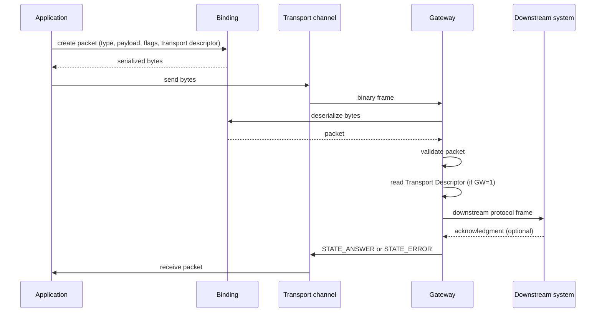

# 01 — Architecture

[← Core README](../README.md) · [Next: Packet Format →](02-packet-format.md)

---

## Overview

WSC is built around a two-tier model: a **Client** that constructs and sends WSC packets, and a **Gateway** that receives them and translates them to downstream industry protocols.

```
┌───────────────────────────────────────────────────────────────────┐
│                           CLIENT                                  │
│                                                                   │
│   Application logic                                               │
│       │  construct packet                                         │
│       ▼                                                           │
│   WSC binding  ──── serialize ──────▶  binary frame               │
│       │                                                           │
│   WSC transport layer ────────────── primary channel ───────────┐ │
└─────────────────────────────────────────────────────────────────┼─┘
                                                                  │
                          network (LAN / local)                   │
                                                                  │
┌─────────────────────────────────────────────────────────────────▼─┐
│                           GATEWAY                                 │
│                                                                   │
│   WSC transport layer                                             │
│       │  deserialize ──────▶  packet                              │
│       ▼                                                           │
│   Gateway router  ──── reads Transport Descriptor                 │
│       │                                                           │
│       ├──▶  Art-Net / sACN  ─────▶  lighting nodes                │
│       ├──▶  OSC             ─────▶  show-control software         │
│       ├──▶  MIDI / MSC      ─────▶  show controllers              │
│       ├──▶  Modbus          ─────▶  automation hardware           │
│       └──▶  RAW             ─────▶  custom & raw protocol encaps  │
│       └──▶  ...             ─────▶  future implementation         │
└───────────────────────────────────────────────────────────────────┘
```

---

## Components

### Binding

A **binding** is a language-specific, I/O-free implementation of the WSC wire format. It provides:

- Packet construction, serialization, and deserialization
- Payload encoding and decoding for every message type
- Address construction and wire encoding
- Transport Descriptor assembly
- Structural validation and compatibility-matrix enforcement

The binding deals only with bytes. It has no knowledge of connections, sockets, or transport mechanisms. It is consumed by both client and gateway implementations.

See [`bindings/`](../../bindings/README.md) for available language bindings.

### Client implementation

A **client implementation** wraps a binding and a transport mechanism to connect to a gateway and exchange WSC packets. It manages:

- Connection establishment and lifecycle
- Packet ID sequencing
- Session keepalive
- Incoming packet dispatch to application code

### Gateway implementation

A **gateway implementation** wraps a binding and acts as the server-side peer. It manages:

- Accepting inbound client connections
- Deserializing received packets
- Reading the Transport Descriptor on packets where `GW = 1`
- Routing packets to protocol-specific forwarding modules
- Translating and forwarding packets to downstream systems

The gateway organises its forwarding logic into **gateways** — modules that handle a logical class of message types:

| Gateway module | Message types handled |
|---|---|
| Stream Gateway | `STREAM_CHANNELS`, `STREAM_TIMECODE` |
| Control Gateway | `CONTROL_CUE`, `CONTROL_PARAM` |
| State Gateway | `STATE_QUERY` |

Each gateway module dispatches further on the downstream protocol declared in the Transport Descriptor.

### Layer relationships

```
binding             wire format only — no I/O, no state
    ↑
client impl         binding + transport + connection lifecycle
gateway impl        binding + transport + downstream routing
```

See [`implementations/`](../../implementations/README.md) for available implementations.

---

## Data Flow



---

## Deployment Topology

### Local LAN (typical)

```
Client ─── primary channel / LAN ───▶  Gateway
                                           │
                                 ──────────┴──────────
                                 │                   │
                           Art-Net / UDP        DMX512 / Serial
                                 │                   │
                           Lighting nodes       DMX interface
```

### Single-host (development / testing)

```
Client ─── loopback ───▶  Gateway (localhost)
                                │
                         downstream on LAN
```

---

## Design Decisions

### Transport agnosticism

The WSC wire format does not mandate any specific transport mechanism. The channel between client and gateway is defined by each implementation. The reference implementation uses WebRTC DataChannel; other implementations may use raw TCP, WebSocket, serial, or any reliable ordered byte stream.

### Stateless gateway routing

The Transport Descriptor is embedded in every packet that requires forwarding. The gateway carries no per-client routing state — each packet is self-describing. This simplifies gateway implementations and allows runtime re-targeting without reconnection.

### Unified control range

Cue actions (`CONTROL_CUE`) and parameter writes (`CONTROL_PARAM`) share the Control range (`0x2000 – 0x2FFF`) because they are semantically related — both target named WSC Addresses — and route through the same gateway path. This simplifies dispatcher logic: a single Control Gateway handles both types and dispatches on the downstream protocol.

### Separation of binding and implementation

The binding layer is deliberately thin: bytes in, bytes out, no I/O. This makes it straightforward to port WSC to a new language, and ensures the wire format is testable in complete isolation from any transport layer.

### Local-network focus

WSC is designed for **local-network deployments** where client and gateway share a LAN. NAT traversal and remote connectivity are responsibilities of the transport layer, not the protocol.
