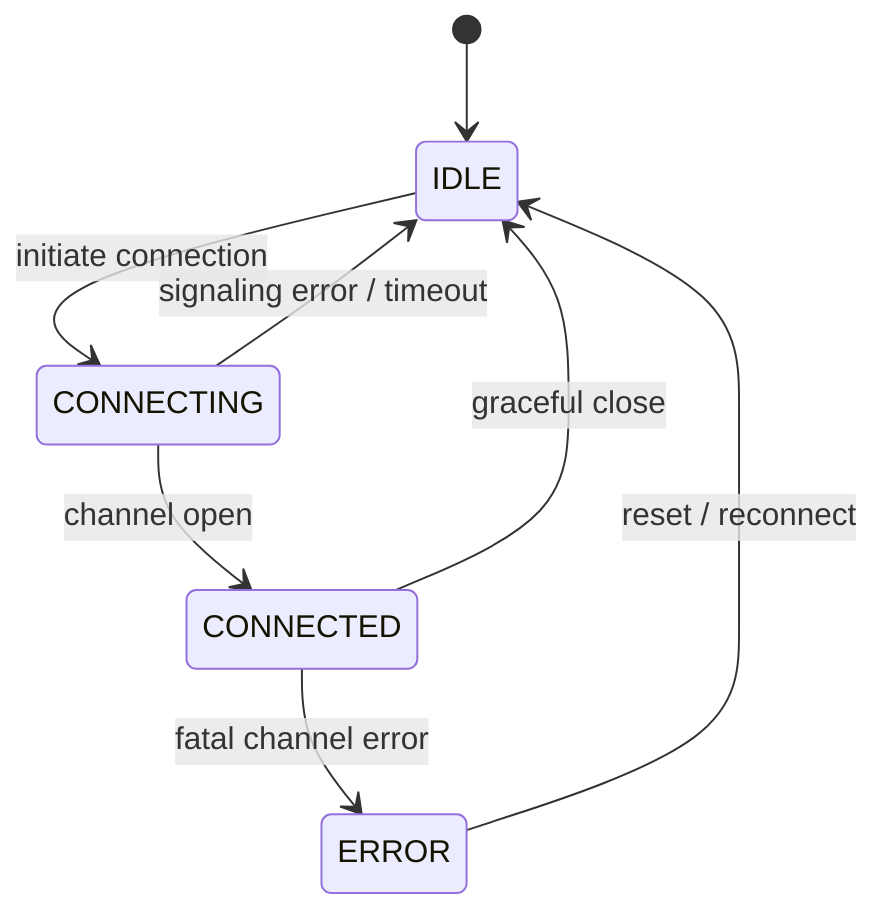
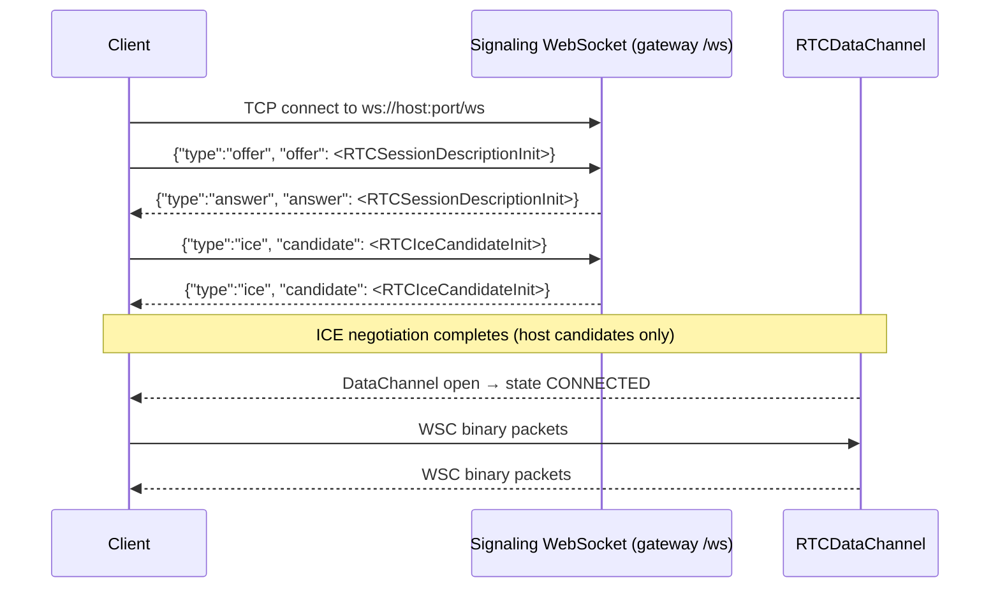

# 06 — Session

[← Transport Descriptor](05-transport-descriptor.md) · [Next: Error Handling →](07-error-handling.md)

---

## Overview

A WSC session is a stateful, bidirectional exchange of packets between a client and a gateway over a reliable, ordered, binary channel. The protocol does not mandate a specific transport mechanism — this is the responsibility of each implementation. The reference transport is a **WebRTC DataChannel** established via a WebSocket signaling exchange.

This document specifies:

- The connection lifecycle and state machine
- The WebRTC / WebSocket signaling exchange used by the reference implementation
- Packet ID sequencing
- Session keepalive obligations
- Disconnection semantics

---

## Connection State Machine

| State | Description |
|---|---|
| `IDLE` | No active connection; ready to initiate |
| `CONNECTING` | Signaling in progress; channel not yet open |
| `CONNECTED` | Channel open; packets may be sent and received |
| `ERROR` | Unrecoverable channel fault; must reconnect |

---

## Reference Transport: WebRTC DataChannel

The reference implementation carries WSC over a **WebRTC DataChannel** (SCTP over DTLS). The DataChannel is established via a WebSocket signaling exchange.

### Signaling Sequence

### Signaling Message Schema

All signaling messages are UTF-8-encoded JSON objects sent over the WebSocket.

| Direction | Message |
|---|---|
| Client → Gateway | `{ "type": "offer",  "offer":  <RTCSessionDescriptionInit> }` |
| Gateway → Client | `{ "type": "answer", "answer": <RTCSessionDescriptionInit> }` |
| Either | `{ "type": "ice", "candidate": <RTCIceCandidateInit> }` |

### ICE Configuration

WSC targets **local-network deployments**. ICE is negotiated using host candidates only; no STUN or TURN servers are required. Implementations MAY add `iceServers` configuration for remote / WAN deployments.

### DataChannel Naming

The client opens the DataChannel with a name of the form `WSC!DC!<timestamp_ms>`. The gateway identifies WSC channels by the `WSC!DC!` prefix.

---

## Alternative Transports

Implementations on other transports MUST preserve the following properties:

| Property | Requirement |
|---|---|
| Ordered delivery | MUST — packets MUST NOT be reordered |
| Reliable delivery | MUST — packets MUST NOT be silently dropped by the transport |
| Binary framing | MUST — each WSC packet MUST be delivered as a discrete unit |
| Full-duplex | MUST — both peers must be able to send at any time |

Suitable alternatives include: raw TCP (with a framing layer), a reliable WebSocket connection, or a UART/serial link with framing.

---

## Packet ID Sequencing

Packet IDs are monotonically incrementing unsigned 32-bit integers in the range `[0x00000001, 0xFFFFFFFF]`, wrapping from `0xFFFFFFFF` back to `1`. The value `0` MUST NOT be used.

The sending implementation assigns the next ID to each outgoing packet immediately before writing it to the channel. Applications MUST NOT set packet IDs manually.

IDs are used to correlate `STATE_QUERY` / `STATE_ANSWER` pairs via the `query_id` field.

---

## Send-Path Behaviour

Implementations SHOULD enforce the following conditions before writing a packet to the channel:

1. The channel is open and ready to accept data.
2. The channel's send buffer is empty (or below a safe threshold).

If the buffer is non-empty, the packet SHOULD be **dropped** rather than queued. This behaviour is appropriate for streaming use cases (DMX, timecode) where a stale frame is useless and queuing causes latency to accumulate. Applications that require guaranteed delivery of every packet SHOULD use the `ACK` flag and implement retry logic at the application layer.

---

## Session Keepalive

Once the channel is open, the client MUST maintain liveness signaling:

| Mechanism | Type | Response required |
|---|---|---|
| `STATE_QUERY(KEEPALIVE)` | Round-trip | Yes — `STATE_ANSWER(SUCCESS)` |

The recommended interval is **1 000 ms** during idle periods. Implementations MAY use shorter intervals in latency-sensitive environments.

The gateway SHOULD treat a liveness signal absence for longer than **5 000 ms** as a connection fault.

---

## Graceful Disconnection

To disconnect cleanly:

1. Stop any keepalive timers.
2. Close the DataChannel (or underlying transport channel).
3. Close the signaling WebSocket (if applicable).
4. Release all associated resources.
5. Transition state to `IDLE`.

Either peer MAY initiate disconnection at any time. The remote peer's `onclose` / equivalent event handler transitions state to `IDLE`.

---

## Reconnection

The WSC protocol has no built-in reconnection mechanism. On closure or error, the application is responsible for re-initiating the connection. Implementations SHOULD expose the connection state to the application to support any reconnection strategy the application requires.
